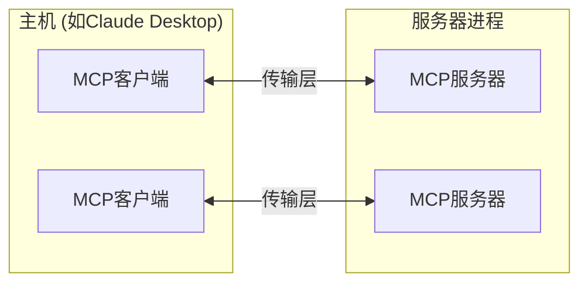

# mcp-demo
just for learn what is mcp

# MCP (Model Context Protocol) 技术报告

## 1. MCP基本概念

### 1.1 什么是MCP？

MCP全称Model Context Protocol（模型上下文协议），是一个开放协议，它标准化了应用程序如何向大语言模型(LLM)提供上下文的方式。可以将MCP比作AI应用的USB-C接口：正如USB-C提供了将设备连接到各种外设的标准方式，MCP为连接AI模型与不同数据源和工具提供了标准化方法。

### 1.2 MCP解决的核心问题

MCP帮助开发者构建基于LLM的智能应用和复杂工作流程。大语言模型经常需要与数据和工具集成，而MCP提供：

- 一系列预构建的集成，可直接与LLM对接
- 在不同LLM提供商和供应商之间切换的灵活性
- 在您的基础设施内保护数据的安全实践
- 降低开发新集成的技术门槛

## 2. MCP架构详解

### 2.1 核心组件

MCP遵循客户端-服务器架构：

- **主机(Hosts)**: 如Claude Desktop或IDE，是启动连接的LLM应用程序
- **客户端(Clients)**: 维护与服务器的1:1连接，位于主机应用程序内部
- **服务器(Servers)**: 向客户端提供上下文、工具和提示



### 2.2 协议层

协议层处理消息框架、请求/响应链接和高级通信模式：

- **请求(Requests)**: 期望对方回应的消息
- **结果(Results)**: 对请求的成功响应
- **错误(Errors)**: 表示请求失败的信息
- **通知(Notifications)**: 不期望回应的单向消息

所有通信使用JSON-RPC 2.0格式交换消息。

### 2.3 传输层

MCP支持多种传输机制：

1. **标准输入/输出(Stdio)传输**:
   - 使用标准输入/输出进行通信
   - 适用于本地进程通信
   - 简单高效

2. **HTTP与SSE传输**:
   - 使用Server-Sent Events进行服务器到客户端的消息传递
   - 使用HTTP POST进行客户端到服务器的消息传递
   - 适用于需要HTTP兼容性的远程通信场景

## 3. MCP核心功能详解

### 3.1 资源(Resources)

资源允许服务器暴露数据内容，可被客户端读取并用作LLM交互的上下文。资源是**应用程序控制的**，意味着客户端应用决定如何使用它们。

#### 3.1.1 资源类型
- **文本资源**: UTF-8编码的文本数据(代码、配置、日志等)
- **二进制资源**: Base64编码的原始数据(图片、PDF等)

#### 3.1.2 资源发现机制
- **直接资源**: 通过`resources/list`端点获取的具体资源
- **资源模板**: 用于构建有效资源URI的动态模板

#### 3.1.3 资源读取示例

```python
@app.list_resources()
async def list_resources() -> list[types.Resource]:
    return [
        types.Resource(
            uri="file:///logs/app.log",
            name="应用日志",
            mimeType="text/plain"
        )
    ]

@app.read_resource()
async def read_resource(uri: AnyUrl) -> str:
    if str(uri) == "file:///logs/app.log":
        log_contents = await read_log_file()
        return log_contents
    
    raise ValueError("资源未找到")
```

### 3.2 工具(Tools)

工具使LLM能够通过服务器执行操作。工具是**模型控制的**，意味着工具是为了让AI模型自动调用而设计的（通常有人类在循环中批准）。

#### 3.2.1 工具定义结构
```typescript
{
  name: string;          // 工具唯一标识符
  description?: string;  // 人类可读描述
  inputSchema: {         // 工具参数的JSON Schema
    type: "object",
    properties: { ... }  // 工具特定参数
  }
}
```

#### 3.2.2 工具实现示例

```typescript
server.setRequestHandler(ListToolsRequestSchema, async () => {
  return {
    tools: [{
      name: "calculate_sum",
      description: "将两个数字相加",
      inputSchema: {
        type: "object",
        properties: {
          a: { type: "number" },
          b: { type: "number" }
        },
        required: ["a", "b"]
      }
    }]
  };
});

server.setRequestHandler(CallToolRequestSchema, async (request) => {
  if (request.params.name === "calculate_sum") {
    const { a, b } = request.params.arguments;
    return {
      content: [
        {
          type: "text",
          text: `结果是: ${a + b}`
        }
      ]
    };
  }
  throw new Error("工具未找到");
});
```

### 3.3 提示(Prompts)

提示使服务器能够定义可重用的提示模板和工作流程。提示是**用户控制的**，意味着它们是让用户能够明确选择使用的。

#### 3.3.1 提示结构

```typescript
{
  name: string;              // 提示唯一标识符
  description?: string;      // 人类可读描述
  arguments?: [              // 可选参数列表
    {
      name: string;          // 参数标识符
      description?: string;  // 参数描述
      required?: boolean;    // 是否必需
    }
  ]
}
```

#### 3.3.2 提示实现示例

```python
@app.list_prompts()
async def list_prompts() -> list[types.Prompt]:
    return [
        types.Prompt(
            name="git-commit",
            description="生成Git提交信息",
            arguments=[
                types.PromptArgument(
                    name="changes",
                    description="Git差异或变更描述",
                    required=True
                )
            ],
        )
    ]

@app.get_prompt()
async def get_prompt(
    name: str, arguments: dict[str, str] | None = None
) -> types.GetPromptResult:
    if name == "git-commit":
        changes = arguments.get("changes") if arguments else ""
        return types.GetPromptResult(
            messages=[
                types.PromptMessage(
                    role="user",
                    content=types.TextContent(
                        type="text",
                        text=f"为以下变更生成简洁但描述性的提交信息:\n\n{changes}"
                    )
                )
            ]
        )
```

### 3.4 采样(Sampling)

采样是MCP的一个功能，它允许服务器通过客户端请求LLM完成，从而实现复杂的代理行为，同时保持安全性和隐私性。

**注意**：此功能目前在Claude Desktop客户端中尚不支持。

## 4. MCP集成与应用场景

### 4.1 支持MCP的客户端应用

| 客户端                 | 资源支持 | 提示支持 | 工具支持 | 采样 | 备注                          |
|-----------------------|---------|---------|---------|------|-------------------------------|
| Claude Desktop App    | ✅      | ✅      | ✅      | ❌   | 全面支持所有MCP功能            |
| Zed                   | ❌      | ✅      | ❌      | ❌   | 提示作为斜杠命令出现           |
| Sourcegraph Cody      | ✅      | ❌      | ❌      | ❌   | 通过OpenCTX支持资源           |
| Firebase Genkit       | ⚠️      | ✅      | ✅      | ❌   | 通过工具支持资源列表和查找     |
| Continue              | ✅      | ✅      | ✅      | ❌   | 全面支持所有MCP功能            |
| GenAIScript           | ❌      | ❌      | ✅      | ❌   | 支持工具                      |
| Cline                 | ✅      | ❌      | ✅      | ❌   | 支持工具和资源                |

### 4.2 实际应用场景

#### 4.2.1 天气服务器示例

以天气服务器为例，展示MCP如何工作：

1. 用户向Claude提问："萨克拉门托的天气如何？"
2. Claude分析可用工具，决定使用天气服务器提供的`get-forecast`工具
3. 客户端通过MCP服务器调用`get-forecast`工具，传递经纬度参数
4. 天气服务器执行API调用获取实时天气数据
5. 结果返回给Claude，生成自然语言响应
6. 响应展示给用户

在这个流程中，MCP使Claude能够访问外部天气数据服务，而不需要自身包含这些功能。

#### 4.2.2 文件系统访问

MCP允许LLM安全地访问本地文件：

1. 用户请求Claude分析一个本地代码文件
2. Claude通过文件系统服务器的`list_resources`和`read_resource`功能定位并读取文件
3. 文件内容作为上下文提供给Claude
4. Claude分析代码并提供反馈

#### 4.2.3 数据库查询

MCP可以为LLM提供数据库访问能力：

1. 用户要求Claude分析最近的销售数据
2. Claude通过PostgreSQL服务器的工具构建查询
3. 服务器执行查询并返回结果
4. Claude分析数据并生成洞察报告

## 5. 实现与集成

### 5.1 服务器实现示例

**Python实现**:
```python
import asyncio
import mcp.types as types
from mcp.server import Server
from mcp.server.stdio import stdio_server

app = Server("example-server")

@app.list_resources()
async def list_resources() -> list[types.Resource]:
    return [
        types.Resource(
            uri="example://resource",
            name="示例资源"
        )
    ]

async def main():
    async with stdio_server() as streams:
        await app.run(
            streams[0],
            streams[1],
            app.create_initialization_options()
        )

if __name__ == "__main__":
    asyncio.run(main())
```

**TypeScript实现**:
```typescript
import { Server } from "@modelcontextprotocol/sdk/server/index.js";
import { StdioServerTransport } from "@modelcontextprotocol/sdk/server/stdio.js";

const server = new Server({
  name: "example-server",
  version: "1.0.0"
}, {
  capabilities: {
    resources: {}
  }
});

server.setRequestHandler(ListResourcesRequestSchema, async () => {
  return {
    resources: [
      {
        uri: "example://resource",
        name: "示例资源"
      }
    ]
  };
});

const transport = new StdioServerTransport();
await server.connect(transport);
```

### 5.2 与Claude Desktop的集成

1. 安装Claude Desktop应用
2. 配置`claude_desktop_config.json`文件:

```json
{
    "mcpServers": {
        "weather": {
            "command": "python",
            "args": [
                "/绝对路径/到/天气服务器.py"
            ]
        },
        "filesystem": {
            "command": "npx",
            "args": [
                "-y", 
                "@modelcontextprotocol/server-filesystem", 
                "/允许访问文件路径"
            ]
        }
    }
}
```

3. 重启Claude Desktop应用
4. 使用工具图标查看已连接的服务器和可用工具

### 5.3 自定义客户端实现

开发者也可以实现自己的MCP客户端:

```python
from mcp import ClientSession, StdioServerParameters
from mcp.client.stdio import stdio_client

async def main():
    server_params = StdioServerParameters(
        command="python",
        args=["server.py"]
    )
    
    async with stdio_client(server_params) as streams:
        async with ClientSession(streams[0], streams[1]) as session:
            await session.initialize()
            
            # 列出可用工具
            tools_response = await session.list_tools()
            print(f"可用工具: {[tool.name for tool in tools_response.tools]}")
            
            # 调用工具
            result = await session.call_tool("example_tool", {"param": "value"})
            print(f"工具结果: {result}")
```

## 6. MCP开发最佳实践

### 6.1 设计原则

1. **专注于单一职责**: 每个服务器应专注于提供特定领域的功能
2. **明确的文档**: 为所有资源、工具和提示提供清晰描述
3. **适当的错误处理**: 提供有意义的错误消息和恰当的状态码
4. **安全性优先**: 验证输入、限制资源访问、实现适当的权限控制
5. **响应式设计**: 实现进度报告和资源订阅以提供实时更新

### 6.2 安全最佳实践

1. **输入验证**: 彻底验证所有参数和输入
2. **路径清洗**: 防止目录遍历攻击
3. **权限控制**: 实现细粒度的资源访问控制
4. **速率限制**: 防止过度使用和DoS攻击
5. **安全传输**: 使用TLS进行远程连接
6. **错误处理**: 不要在错误消息中泄露敏感信息

### 6.3 性能优化

1. **连接复用**: 避免频繁创建和关闭连接
2. **资源缓存**: 缓存频繁访问的资源
3. **分页**: 对大型资源列表实现分页
4. **懒加载**: 仅在需要时加载详细内容
5. **流式传输**: 对大型资源使用流式处理

## 7. 调试与故障排除

### 7.1 调试工具

1. **MCP Inspector**: 交互式调试界面，用于直接测试服务器
2. **Claude Desktop开发者工具**: 集成测试、日志收集、Chrome DevTools集成
3. **服务器日志**: 自定义日志实现、错误跟踪、性能监控

### 7.2 常见问题及解决方法

#### 7.2.1 环境变量问题

MCP服务器仅继承部分环境变量。在`claude_desktop_config.json`中使用`env`键指定所需环境变量:

```json
{
  "myserver": {
    "command": "mcp-server-myapp",
    "env": {
      "MYAPP_API_KEY": "some_key"
    }
  }
}
```

#### 7.2.2 服务器初始化问题
- 检查可执行文件路径是否正确
- 验证必需文件是否存在
- 确保有适当的执行权限

#### 7.2.3 连接问题
- 检查Claude Desktop日志
- 验证服务器进程是否运行
- 使用Inspector独立测试
- 验证协议兼容性

## 8. 现有MCP服务器生态系统

### 8.1 官方参考实现

#### 8.1.1 数据与文件系统
- **Filesystem**: 具有可配置访问控制的安全文件操作
- **PostgreSQL**: 具有模式检查功能的只读数据库访问
- **SQLite**: 数据库交互和商业智能功能
- **Google Drive**: Google Drive的文件访问和搜索功能

#### 8.1.2 开发工具
- **Git**: 读取、搜索和操作Git仓库的工具
- **GitHub**: 仓库管理、文件操作和GitHub API集成
- **GitLab**: 支持项目管理的GitLab API集成
- **Sentry**: 从Sentry.io检索和分析问题

#### 8.1.3 网络与浏览器自动化
- **Brave Search**: 使用Brave搜索API进行网络和本地搜索
- **Fetch**: 针对LLM使用优化的Web内容获取和转换
- **Puppeteer**: 浏览器自动化和Web抓取功能

### 8.2 官方集成

- **Axiom**: 使用自然语言查询和分析日志、追踪和事件数据
- **Cloudflare**: 在Cloudflare开发者平台上部署和管理资源
- **E2B**: 在安全的云沙箱中执行代码
- **Neon**: 与Neon无服务器Postgres平台交互
- **Qdrant**: 使用Qdrant向量搜索引擎实现语义记忆

### 8.3 社区实现

- **Docker**: 管理容器、镜像、卷和网络
- **Kubernetes**: 管理Pod、部署和服务
- **Linear**: 项目管理和问题跟踪
- **Snowflake**: 与Snowflake数据库交互
- **Spotify**: 控制Spotify播放和管理播放列表

## 9. MCP的优势与价值

### 9.1 与传统集成方式对比

| 对比维度     | 传统方式                                   | MCP方式                                        |
|------------|-------------------------------------------|-----------------------------------------------|
| 可扩展性     | 为每个LLM开发专用集成                       | 一次开发，多个LLM可用                            |
| 标准化      | 不同集成使用不同格式和协议                   | 统一的协议和接口标准                             |
| 安全性      | 安全措施不一致                             | 统一的安全最佳实践                               |
| 开发效率    | 重复实现相似功能                           | 可重用组件和预构建服务器                          |
| 用户体验    | 交互不一致                                | 统一的交互模型，人机协作循环                       |

### 9.2 MCP带来的核心价值

1. **统一接口**: 为LLM提供标准化的数据和工具访问方式
2. **安全边界**: 明确的权限模型和人类在循环中的批准
3. **开发效率**: 减少重复工作，加速集成开发
4. **互操作性**: 在不同LLM提供商之间切换而无需重写集成
5. **生态系统**: 可重用服务器和工具的不断增长库

## 10. 结论与展望

MCP为LLM与外部世界的交互提供了标准化方法，解决了传统集成方式的碎片化问题。通过允许LLM安全地访问外部数据和工具，MCP极大地扩展了AI应用的能力边界。

随着生态系统的不断发展，我们可以期待：
- 更多专业领域服务器的出现
- 增强的安全模型和权限控制
- 更广泛的客户端支持
- 远程MCP主机支持的发展
- 社区驱动的创新和最佳实践

MCP不仅是一个技术标准，更是构建下一代AI应用的基础设施，它将帮助开发者构建更强大、更安全、更有用的AI系统。

---

## 资源与下一步

- 访问[modelcontextprotocol.info](https://modelcontextprotocol.info)获取完整文档
- 查看[GitHub仓库](https://github.com/modelcontextprotocol)上的SDK和示例
- 使用[MCP Inspector](https://github.com/modelcontextprotocol/inspector)测试和调试服务器
- 探索[现有服务器示例](https://modelcontextprotocol.info/examples)
- 加入[GitHub讨论](https://github.com/orgs/modelcontextprotocol/discussions)参与社区
